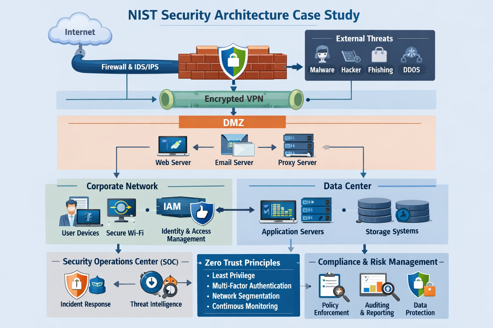
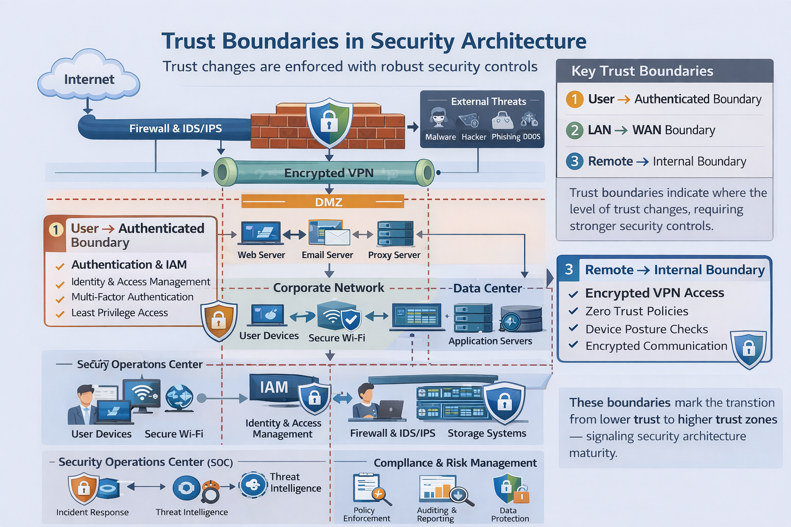
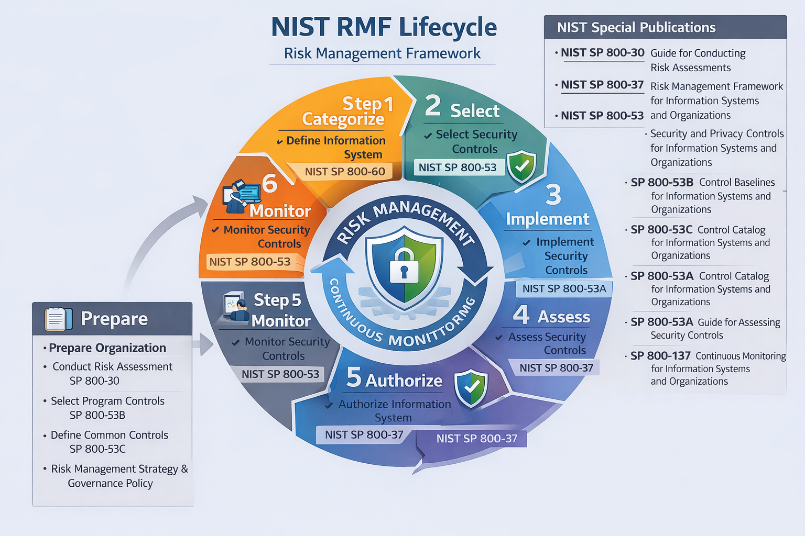

# Threat-Informed Defensive Architecture Analysis
## DoD Contractor Environment | NIST SP 800-53 | MITRE ATT&CK Mapping

**Analyst:** Millie Altman
**Classification:** UNCLASSIFIED // FOR PORTFOLIO USE  
**Date:** August 2025  
**Status:** Final  

---

## Analyst Note

This analysis presents a threat-informed defensive architecture developed for a fictional DoD-aligned federal contractor, Blue Stripe Tech, preparing to support the U.S. Air Force Cyber Security Center. The architecture was designed to mitigate adversary TTPs commonly observed against defense industrial base (DIB) targets, operationalize DoD compliance requirements as defensive controls, and establish a scalable security posture aligned with Zero Trust principles.

All architectural decisions are grounded in threat likelihood, mission impact, and regulatory obligation — not compliance checkbox exercises. Control selection is mapped to adversary behaviors using MITRE ATT&CK where applicable.

---

## Threat Environment Summary

Defense contractors handling Controlled Unclassified Information (CUI) represent high-value targets for both nation-state actors and cybercriminal groups. The DIB sector faces a persistent and sophisticated threat landscape driven by the following primary threat actors and motivations:

**Nation-State Actors (Primary Threat)**  
Groups assessed with high confidence to target DIB organizations include APT10 (China-nexus), APT29 (Russia-nexus), and Lazarus Group (DPRK-nexus). These actors prioritize intellectual property theft, long-term persistence, and pre-positioning for future operations. Techniques commonly observed include spearphishing, valid account abuse, living-off-the-land (LOTL) execution, and encrypted C2 communications to evade detection.

**Cybercriminal Actors (Secondary Threat)**  
Ransomware operators including LockBit and BlackCat affiliates have increasingly targeted government contractors. Initial access is typically achieved through phishing, exposed remote access services, or credential theft. These actors prioritize rapid lateral movement and data exfiltration prior to encryption.

**Insider Threat (Tertiary Threat)**  
Organizations handling CUI face elevated insider risk from both malicious and negligent insiders. Threat scenarios include unauthorized data exfiltration, policy circumvention, and credential sharing.

**Key Priority Intelligence Requirements (PIRs) Driving This Architecture:**
- PIR 1: What TTPs are nation-state actors using to achieve initial access against DIB targets?
- PIR 2: How are adversaries moving laterally within contractor networks after initial compromise?
- PIR 3: What data exfiltration techniques are being used to exfiltrate CUI from contractor environments?

---

## Compliance & Regulatory Drivers

The following laws and directives shaped control selection and architectural decisions. Each is framed here in terms of its defensive relevance, not just its legal obligation:

| Regulation | Defensive Relevance |
|---|---|
| **FISMA** | Mandates structured risk management, incident response, and continuous monitoring — directly enabling threat detection capabilities |
| **DFARS 252.204-7012** | Requires 72-hour incident reporting and CUI protection — drives logging, alerting, and IR readiness |
| **CMMC 2.0 (Level 2)** | Establishes foundational controls for CUI environments — aligns with baseline security hygiene that reduces attack surface |
| **Executive Order 13556 (CUI)** | Mandates access controls and encryption for sensitive data — directly mitigates exfiltration TTPs |
| **DoD Instruction 8510.01 (RMF)** | Provides the risk management lifecycle — ensures controls are continuously assessed, not statically deployed |

---

## Architecture Overview

The security architecture employs a **defense-in-depth, Zero Trust** approach organized across distinct security domains. Trust is never assumed — it is explicitly established and continuously verified through authentication, authorization, monitoring, and segmentation at every boundary.

**Core Design Principles:**
- Explicit trust boundaries at every domain transition
- Least privilege access enforced at user, system, and application layers
- Continuous monitoring and centralized logging across all domains
- Control selection driven by threat likelihood and mission impact, not compliance alone
- Scalable architecture adaptable to evolving adversary TTPs



The architecture is organized across five security domains, each with distinct threat vectors and corresponding controls:

```
Internet → [Firewall / IDS/IPS] → DMZ → [Encrypted VPN] → Internal Network
                                          ↓
                              Corporate Network | Data Center
                                          ↓
                              Security Operations Center (SOC)
```

**Trust Boundary Enforcement Points:**

| Boundary | Control Mechanism | Threat Mitigated |
|---|---|---|
| User → Authenticated Access | MFA, IAM, least privilege | Credential theft, account takeover |
| LAN → WAN | Next-gen firewall, IDS/IPS, content inspection | C2 communication, data exfiltration |
| Remote → Internal | DoD-approved VPN, endpoint posture checks, CAC/PIV | Unauthorized remote access, lateral movement |



---

## DoD Risk Management Framework (RMF) Lifecycle

All controls in this architecture are implemented within the DoD RMF lifecycle, ensuring continuous authorization and ongoing risk assessment rather than point-in-time compliance validation.



| RMF Step | Action | CTI Relevance |
|---|---|---|
| **Categorize** | Define system impact levels, identify CUI handling requirements | Establish what assets adversaries would prioritize targeting |
| **Select** | Choose controls from NIST SP 800-53 baselines | Align control selection to observed adversary TTPs |
| **Implement** | Deploy controls at appropriate architectural layers | Ensure detection and prevention capabilities are operational |
| **Assess** | Validate control effectiveness | Test controls against known adversary techniques |
| **Authorize** | Risk-based authorization decision | Accept residual risk with full threat context |
| **Monitor** | Continuous control assessment and threat monitoring | Enable ongoing detection of emerging TTPs |

---

## Control Mapping by Domain (with MITRE ATT&CK)

Controls are mapped to architectural domains and linked to MITRE ATT&CK techniques they mitigate. This translates compliance requirements into adversary-focused defensive posture.

---

### Domain 1: User Domain

**Threat Focus:** Insider threat, credential theft, phishing-enabled account compromise

| Control | NIST ID | ATT&CK Technique Mitigated | Implementation |
|---|---|---|---|
| Role-Based Access Control | AC-2, AC-3, AC-6 | T1078 – Valid Accounts | Enforce least privilege; limit blast radius of compromised credentials |
| Multi-Factor Authentication | IA-2 | T1110 – Brute Force; T1078 – Valid Accounts | MFA required for all privileged and remote access |
| Security Awareness Training | AT-2, AT-3 | T1566 – Phishing | Mandatory annual + role-based training to reduce human attack surface |
| Account Provisioning/Deprovisioning | AC-2 | T1078.004 – Cloud Accounts | Timely removal of access reduces insider and stale credential risk |

---

### Domain 2: Workstation & Endpoint Domain

**Threat Focus:** Malware delivery, living-off-the-land execution, endpoint persistence

| Control | NIST ID | ATT&CK Technique Mitigated | Implementation |
|---|---|---|---|
| Secure Baseline Configuration | CM-2, CM-6 | T1190 – Exploit Public-Facing Application | DISA STIGs applied to all endpoints |
| Endpoint Detection & Response | SI-3 | T1059 – Command & Scripting Interpreter; T1055 – Process Injection | EDR deployed for behavioral detection beyond signature-based AV |
| Patch & Vulnerability Management | SI-2 | T1203 – Exploitation for Client Execution | Timely patching aligned to DoD vulnerability timelines |
| Full-Disk Encryption | SC-12, SC-13 | T1005 – Data from Local System | Protects CUI on endpoints against physical theft and exfiltration |

---

### Domain 3: Network & Perimeter Domain

**Threat Focus:** Lateral movement, network reconnaissance, C2 communication

| Control | NIST ID | ATT&CK Technique Mitigated | Implementation |
|---|---|---|---|
| Network Segmentation (VLANs) | SC-7 | T1021 – Remote Services; T1570 – Lateral Tool Transfer | Isolate R&D, admin, and production environments |
| Intrusion Detection/Prevention | SI-4 | T1071 – Application Layer Protocol (C2); T1046 – Network Service Scanning | Inline IDS/IPS inspects inbound and outbound traffic continuously |
| Centralized Logging & Monitoring | AU-2, AU-6 | T1562 – Impair Defenses | Centralized SIEM collection enables detection of log tampering and anomalous behavior |
| Boundary Protection (Firewall) | SC-7 | T1133 – External Remote Services | Deny-all-except rules; strict port and protocol restrictions |

---

### Domain 4: WAN & Remote Access Domain

**Threat Focus:** Unauthorized remote access, credential interception, VPN exploitation

| Control | NIST ID | ATT&CK Technique Mitigated | Implementation |
|---|---|---|---|
| DoD-Approved VPN with MFA | AC-17, IA-2 | T1133 – External Remote Services; T1078 – Valid Accounts | CAC/PIV authentication required; split tunneling prohibited |
| FIPS-Validated Encryption | SC-13 | T1557 – Adversary-in-the-Middle | AES-256 with SHA-256 protects data in transit |
| Endpoint Posture Validation | CM-6 | T1199 – Trusted Relationship | Pre-connection compliance checks prevent unmanaged device access |
| Session Timeout Controls | AC-17 | T1563 – Remote Service Session Hijacking | 15-minute inactivity timeout limits session hijacking exposure |

---

### Domain 5: System & Application Domain

**Threat Focus:** Application exploitation, privilege escalation, audit log tampering

| Control | NIST ID | ATT&CK Technique Mitigated | Implementation |
|---|---|---|---|
| Secure Software Development (SSDLC) | SA-11 | T1190 – Exploit Public-Facing Application | Static and dynamic application security testing prior to production |
| Application STIG Compliance | CM-6 | T1083 – File and Directory Discovery | DISA application STIGs applied to web, database, and app servers |
| Audit Logging & Review | AU-2, AU-6, AU-12 | T1562.002 – Disable Windows Event Logging | Centralized audit logging with regular review and alerting |
| Least Privilege Enforcement | AC-6 | T1068 – Exploitation for Privilege Escalation | Role-based access limits privilege escalation impact |

---

## Defensive Recommendations

Based on this architecture analysis and the current DIB threat environment, the following recommendations are assessed as highest priority for reducing adversary opportunity:

**1. Prioritize EDR Over Legacy AV (High Priority)**  
Nation-state actors targeting DIB organizations consistently use LOTL techniques that bypass signature-based antivirus. Behavioral EDR solutions significantly improve detection of T1059 (scripting interpreter abuse) and T1055 (process injection).

**2. Implement Deception Technology at Network Boundaries (Medium Priority)**  
Honeytokens and honeypot systems placed in high-value network segments (particularly adjacent to CUI storage) provide early warning of lateral movement and reduce adversary dwell time.

**3. Establish Threat Intelligence Feeds Tied to DIB Threat Actors (High Priority)**  
Integrate commercial or government threat intel feeds (e.g., CISA advisories, DIBNet) to continuously update detection rules based on current adversary TTPs targeting the defense sector.

**4. Conduct Regular Purple Team Exercises (Medium Priority)**  
Validate control effectiveness against adversary TTPs through collaborative red/blue team exercises, particularly targeting the techniques mapped in this analysis (T1078, T1566, T1071).

**5. Zero Trust Maturity Advancement (Long-Term)**  
The current architecture establishes a Zero Trust foundation. Priority next steps include micro-segmentation of the data center, continuous device trust validation, and identity-centric access policies.

---

## Analytical Confidence Assessment

| Assessment | Confidence Level | Rationale |
|---|---|---|
| Nation-state actors represent primary threat to DIB | **High** | Consistent with CISA, FBI, and NSA joint advisories; well-documented targeting of defense contractors |
| Phishing is the most likely initial access vector | **High** | Corroborated by multiple threat intelligence sources and incident reporting |
| Current architecture adequately mitigates ransomware TTPs | **Moderate** | Controls are sound; effectiveness depends on consistent implementation and monitoring maturity |
| LOTL techniques will increase in prevalence | **Moderate** | Assessed based on current nation-state tradecraft trends; subject to change |

---

## Skills & Frameworks Demonstrated

- Threat-informed defensive architecture design
- MITRE ATT&CK TTP mapping to security controls
- DoD RMF lifecycle application
- NIST SP 800-53 Rev. 5 control selection and rationale
- Priority Intelligence Requirements (PIR) development
- Analytical confidence assessment methodology
- Zero Trust architecture principles

---

## References

- DoD Instruction 8500.01: Cybersecurity
- DoD Instruction 8510.01: Risk Management Framework (RMF) for DoD IT
- DoD Instruction 8170.01: Online Information Management and Electronic Messaging
- DoD Manual 5200.01, Vol. 1: DoD Information Security Program
- Cybersecurity Maturity Model Certification (CMMC) 2.0 — dodcio.defense.gov/CMMC/
- NIST SP 800-53 Rev. 5: Security and Privacy Controls for Information Systems and Organizations
- NIST SP 800-171 Rev. 2: Protecting Controlled Unclassified Information in Nonfederal Systems
- NIST SP 800-37: Risk Management Framework for Information Systems and Organizations
- Federal Information Security Modernization Act (FISMA)
- Executive Order 13556: Controlled Unclassified Information (CUI)
- DFARS 252.204-7012: Safeguarding Covered Defense Information
- MITRE ATT&CK Framework — attack.mitre.org
