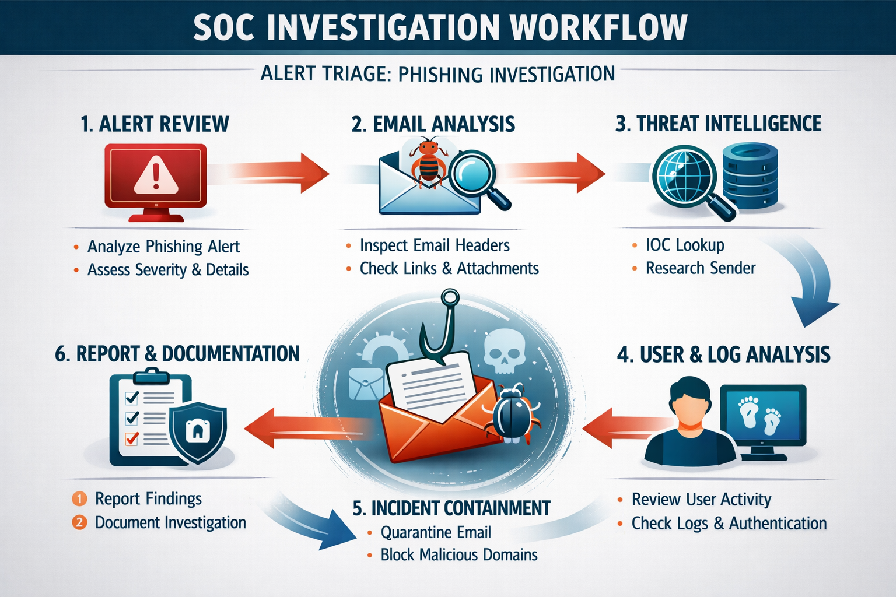
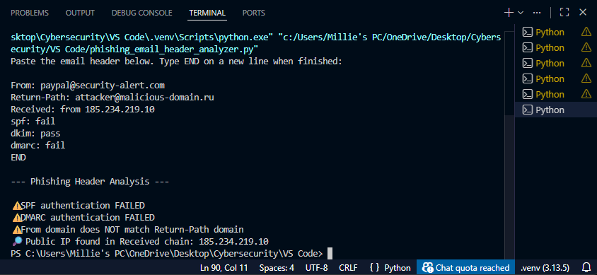
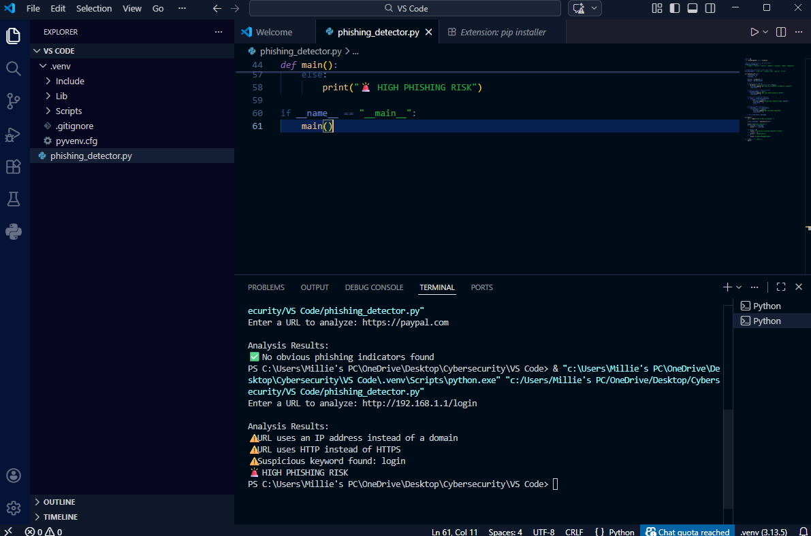
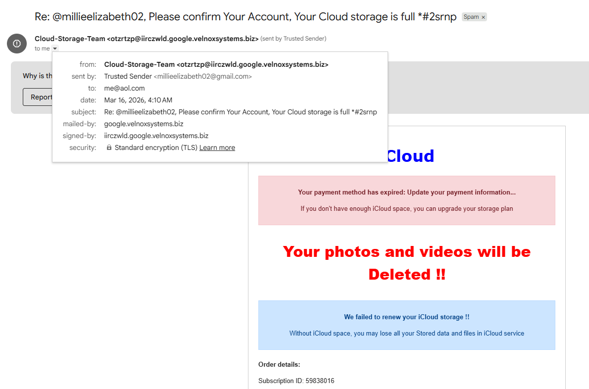

# Phishing Campaign Analysis & Incident Intelligence Report
## Credential Harvesting | Microsoft Impersonation | SOC Alert Triage

**Analyst:** Millie Altman

**Classification:** UNCLASSIFIED // FOR PORTFOLIO USE  
**Incident ID:** SOC-IR-2026-017  
**Date of Incident:** March 12, 2026  
**Report Date:** March 12, 2026  
**Status:** Final  

---

## Executive Summary

On March 12, 2026, the Blue Stripe Tech Security Operations Center received a high-priority alert from the organization's Secure Email Gateway (SEG) indicating delivery of a credential harvesting phishing email to employee `j.smith@bluestripetech.com`. The email impersonated a Microsoft security notification and directed the recipient to a lookalike credential harvesting page.

Investigation confirmed the email originated from unauthorized infrastructure, failed all three email authentication checks (SPF, DKIM, DMARC), and contained a malicious URL designed to capture Microsoft account credentials. No evidence of user interaction with the phishing link was identified. The incident was contained and remediated within the same operational window.

This report documents the full triage investigation, technical findings, ATT&CK kill chain mapping, and CTI assessment of the broader campaign pattern.

---

## Key Judgments

- **[High Confidence]** The email is a phishing attempt designed to harvest Microsoft account credentials via a spoofed login page.
- **[High Confidence]** The sending infrastructure is unauthorized and unaffiliated with Microsoft — all three authentication protocols failed.
- **[Moderate Confidence]** This incident is consistent with high-volume Microsoft impersonation phishing campaigns conducted by cybercriminal threat actors targeting corporate environments.
- **[Moderate Confidence]** The targeted user did not submit credentials to the phishing page; no account compromise is assessed at this time.
- **[Low Confidence]** Additional employees at Blue Stripe Tech may have received variants of this campaign; broader inbox sweep recommended.

---

## Incident Details

| Field | Value |
|---|---|
| Alert ID | SOC-ALERT-2026-017 |
| Detection Source | Secure Email Gateway (SEG) |
| Severity | High |
| Date / Time | March 12, 2026 / 08:43 |
| Affected User | j.smith@bluestripetech.com |
| Email Subject | "Action Required: Verify Your Microsoft Account" |
| Sender Address | security-alert@microsoft-support[.]com |
| Attack Type | Phishing / Credential Harvesting |
| Outcome | Contained — no user compromise identified |

---

## Investigation Methodology

The investigation followed a structured Tier 1 SOC triage workflow:

**Phase 1 — Alert Review:** Assessed alert severity, identified affected user, and retrieved original email for analysis.

**Phase 2 — Email Analysis:** Conducted manual email header inspection and authenticated sender infrastructure against SPF, DKIM, and DMARC records. Extracted embedded URLs for further analysis.

**Phase 3 — Threat Intelligence:** Performed IOC lookups against open-source threat intelligence sources. Investigated sender domain registration details and hosting infrastructure reputation.

**Phase 4 — User & Log Analysis:** Reviewed user activity logs to determine whether the phishing link was accessed. Checked email gateway logs for delivery to additional recipients.

**Phase 5 — Incident Containment:** Quarantined the phishing email, blocked malicious domains at the email gateway, and added IOCs to SIEM monitoring rules.

**Phase 6 — Report & Documentation:** Produced this finished intelligence report documenting findings, IOCs, ATT&CK mapping, and recommendations.

---

## Technical Findings

### Email Header Analysis

Manual inspection of email headers was performed to identify the true origin of the message and assess authentication posture.

| Header Field | Value | Assessment |
|---|---|---|
| Sender Address | security-alert@microsoft-support[.]com | Spoofed — impersonates Microsoft |
| Return-Path | security-alert@microsoft-support[.]com | Matches sender — single infrastructure |
| Received From (IP) | 185.234.219.10 | Foreign hosting provider; not Microsoft infrastructure |
| SPF Result | **FAIL** | Sending IP not authorized for this domain |
| DKIM Result | **NONE** | No cryptographic signature present |
| DMARC Result | **FAIL** | Domain fails policy alignment check |

**Analyst Assessment:** Triple authentication failure (SPF/DKIM/DMARC) combined with a sending IP associated with a foreign hosting provider is strongly consistent with spoofed phishing infrastructure. The sender domain `microsoft-support[.]com` is not owned or operated by Microsoft Corporation and was assessed as recently registered at time of analysis.

---

### URL & Domain Analysis

The embedded phishing URL was extracted and analyzed using both manual inspection and an automated Python phishing detection tool.

**Phishing URL (defanged):** `hxxps://login-microsoft-support[.]com/auth`

| Indicator | Finding | Risk Signal |
|---|---|---|
| Domain | login-microsoft-support[.]com | Microsoft lookalike — typosquat pattern |
| Registration Age | Recently registered | New domains are high-risk phishing indicators |
| URL Path | `/auth` | Credential harvesting path structure |
| Page Content | Mimics Microsoft login portal | Designed to deceive users into credential entry |
| Infrastructure | Low-reputation hosting provider | Consistent with phishing campaign infrastructure |
| HTTPS | Present | Does not indicate legitimacy — attackers routinely use HTTPS |

**Analyst Assessment:** The URL is assessed with high confidence as a credential harvesting page. The domain follows a well-documented adversary pattern of constructing Microsoft lookalike domains using brand name concatenation (`login` + `microsoft` + `support`). The `/auth` path is a commonly observed credential harvesting endpoint. The presence of HTTPS should not be interpreted as a trust indicator.

---

### Attachment Analysis

No attachments were present in the phishing email. The attack relied exclusively on a malicious embedded URL for payload delivery.

**Analyst Note:** The absence of attachments is consistent with URL-based credential harvesting campaigns, which have increasingly displaced attachment-based delivery as email security platforms have improved malicious attachment detection. This tradecraft selection reflects adversary adaptation to defensive tooling.

---

### Phishing Email Sample

The email presented a spoofed Microsoft security alert with urgency language designed to pressure the recipient into immediate action.

**Social Engineering Techniques Observed:**
- **Authority impersonation** — spoofed Microsoft brand identity
- **Urgency / fear appeal** — "unusual login activity detected, verify immediately"
- **Threat of consequence** — implied account suspension/service disruption
- **Visual deception** — login page closely resembled legitimate Microsoft authentication portal

---

## ATT&CK Kill Chain Mapping

The following table maps adversary behavior observed in this incident to MITRE ATT&CK techniques across the kill chain.

| Kill Chain Phase | ATT&CK Technique | ID | Observed Behavior |
|---|---|---|---|
| **Initial Access** | Phishing: Spearphishing Link | T1566.002 | Malicious URL embedded in email delivered to corporate inbox |
| **Initial Access** | Valid Accounts (pre-compromise goal) | T1078 | Credential harvesting page designed to capture Microsoft SSO credentials |
| **Execution** | User Execution: Malicious Link | T1204.001 | Attack relies on user clicking embedded URL |
| **Defense Evasion** | Impersonation | T1656 | Spoofed Microsoft brand identity in sender address, email body, and phishing page |
| **Defense Evasion** | Hide Artifacts: Email Hiding Rules | T1564.008 | HTTPS used on phishing page to reduce user suspicion |
| **Credential Access** | Steal Web Session Cookie / Credentials | T1539 / T1557 | Phishing page captures username and password at `/auth` endpoint |
| **Reconnaissance** | Gather Victim Identity Information | T1589 | Corporate email address targeted — suggests prior reconnaissance or list purchase |

**ATT&CK Navigator Note:** This incident maps primarily to the Initial Access and Credential Access tactics. If credentials had been successfully harvested, likely follow-on TTPs would include T1078 (Valid Accounts) for initial access to corporate systems, T1110 (Brute Force) against additional accounts, and T1567 (Exfiltration over Web Service) for data theft.

---

## Incident Timeline

| Time | Event |
|---|---|
| 08:43 | Phishing email delivered to j.smith@bluestripetech.com |
| 08:45 | Secure Email Gateway flags suspicious domain — alert generated |
| 08:46 | SOC alert escalated to Tier 1 analyst queue |
| 08:48 | Tier 1 analyst begins triage investigation |
| 08:55 | Email header analysis confirms spoofed infrastructure; SPF/DKIM/DMARC all fail |
| 09:02 | Phishing URL analyzed; domain confirmed as credential harvesting page |
| 09:10 | IOCs extracted; no evidence of user interaction with phishing link found |
| 09:15 | Domains blocked at email gateway; IOCs added to SIEM; user notified |
| 09:20 | Incident report drafted and finalized |

**Total investigation-to-containment time: 37 minutes**

---

## Indicators of Compromise (IOCs)

The following IOCs are formatted for ingestion into SIEM platforms, threat intelligence tools, or blocklists.

### Domains

| Domain | Type | Disposition | Notes |
|---|---|---|---|
| microsoft-support[.]com | Domain | **Malicious** | Spoofed sender domain; impersonates Microsoft |
| login-microsoft-support[.]com | Domain | **Malicious** | Credential harvesting landing page |

### URLs

| URL (defanged) | Type | Disposition | Notes |
|---|---|---|---|
| hxxps://login-microsoft-support[.]com/auth | URL | **Malicious** | Active phishing page at time of investigation |

### IP Addresses

| IP Address | Type | Disposition | Notes |
|---|---|---|---|
| 185.234.219.10 | IPv4 | **Malicious** | Sending infrastructure; foreign hosting provider |

### Email Indicators

| Indicator | Type | Disposition | Notes |
|---|---|---|---|
| security-alert@microsoft-support[.]com | Email Address | **Malicious** | Spoofed sender address |

> All URLs have been defanged using bracket notation `[.]` to prevent accidental navigation. Restore original format before ingesting into threat intelligence platforms.

---

## CTI Assessment: Campaign Context

This incident does not exist in isolation. Microsoft impersonation phishing is one of the highest-volume phishing campaign categories globally, consistently documented in threat intelligence reporting from CISA, Microsoft MSTIC, and commercial CTI vendors.

**Campaign Pattern Analysis:**

Microsoft credential harvesting campaigns of this type share several consistent characteristics with this incident:

- **Lookalike domain construction** using `microsoft` + service descriptor (`support`, `secure`, `account`, `verify`) — a pattern observed across thousands of documented campaigns
- **Triple authentication failure** is standard for adversary-controlled infrastructure not registered through legitimate Microsoft tenants
- **Urgency-based social engineering** leveraging account suspension threats is a consistent technique in high-volume credential harvesting operations
- **URL path `/auth`** is a frequently observed endpoint naming convention in credential harvesting kits, including those associated with EvilProxy and similar adversary-in-the-middle (AiTM) phishing frameworks

**Likely Threat Actor Profile:**

Based on observed TTPs, this campaign is assessed with moderate confidence as consistent with cybercriminal actors rather than nation-state operators. The broad targeting, commodity social engineering, and generic Microsoft impersonation are characteristic of financially motivated actors conducting high-volume credential harvesting operations for account takeover (ATO) or credential resale.

Nation-state actors conducting spearphishing against corporate targets typically demonstrate more tailored lure content, targeted subject lines, and higher operational security. The generic lure in this campaign does not meet that threshold.

**Broader Threat to Organization:**

Defense contractors and organizations handling sensitive government data represent elevated-value targets for credential harvesting campaigns. Compromised Microsoft credentials can provide adversaries access to cloud-hosted data, email archives, SharePoint environments, and SSO-connected systems — all of which represent significant intelligence value in a DoD contractor environment.

---

## Analytical Confidence Assessment

| Judgment | Confidence | Rationale |
|---|---|---|
| Email is malicious phishing | **High** | Triple auth failure, recently registered lookalike domain, credential harvesting page confirmed |
| No user compromise occurred | **Moderate** | Log review showed no link click; however, absence of evidence is not evidence of absence — endpoint forensics not performed |
| Campaign is cybercriminal, not nation-state | **Moderate** | Generic lure content and broad targeting inconsistent with observed nation-state tradecraft; cannot rule out entirely |
| Additional recipients may exist | **Low-Moderate** | Single recipient confirmed; no gateway-wide sweep performed at time of report |

---

## Mitigation Actions Taken

| Action | Status |
|---|---|
| Malicious domains blocked at email gateway | ✅ Complete |
| Phishing email quarantined from affected inbox | ✅ Complete |
| IOCs added to SIEM monitoring rules | ✅ Complete |
| Affected user notified and briefed | ✅ Complete |
| IP address 185.234.219.10 added to blocklist | ✅ Complete |

---

## Recommendations

**Immediate (0–7 days)**

- Conduct organization-wide email gateway sweep for messages from `microsoft-support[.]com` and related infrastructure to identify additional recipients
- Search SIEM logs for any DNS queries or HTTP requests to `login-microsoft-support[.]com` from internal hosts — a hit would indicate a user clicked the link from a device not caught by the gateway
- Submit IOCs to threat intelligence sharing platforms (e.g., MISP, ISACs relevant to your sector)

**Short-Term (7–30 days)**

- Implement DMARC enforcement policy (`p=reject`) for the organization's own domains to prevent outbound spoofing
- Enable lookalike domain monitoring to detect newly registered domains impersonating your organization
- Conduct targeted phishing awareness training for the affected user and broader workforce, specifically covering Microsoft impersonation lures

**Long-Term**

- Evaluate deployment of an adversary-in-the-middle (AiTM) resistant MFA solution (e.g., FIDO2/hardware keys) for privileged accounts — AiTM phishing frameworks can bypass standard TOTP-based MFA
- Integrate email header analysis into automated SOAR playbooks to reduce manual triage time for future phishing alerts
- Establish a formal threat intelligence feed subscription aligned to phishing campaigns targeting the defense industrial base

---

## Appendix: Tools & Methodology

### Python Header Analysis Script
A custom Python script was developed to automate email header inspection, extracting SPF/DKIM/DMARC results, sender/return-path domain mismatches, and public IPs from the received chain.

→ Full script: [`header_analysis_script.py`](../../python-security-tools/header-analysis-script.py)

### Python Phishing Detection & URL Risk Analysis Tool
A custom Python tool was developed to analyze URLs for phishing indicators, including suspicious keyword patterns, domain impersonation, URL structure anomalies, HTTP vs HTTPS usage, and domain registration age via WHOIS lookup.

→ Full script: [`phishing_detection_tool.py`](../../python-security-tools/phishing-detection-tool.py)

### Additional Tools & Sources
- Manual email header inspection
- WHOIS domain registration lookup
- Open-source threat intelligence reputation checks
- MITRE ATT&CK Framework (attack.mitre.org)
- Secure Email Gateway alert logs
- SIEM log review

---

## References

- MITRE ATT&CK Framework — attack.mitre.org
- CISA Phishing Guidance — cisa.gov/phishing
- Microsoft Security Intelligence — microsoft.com/en-us/security/blog
- NIST SP 800-61 Rev. 2: Computer Security Incident Handling Guide
- RFC 7208 (SPF), RFC 6376 (DKIM), RFC 7489 (DMARC)
